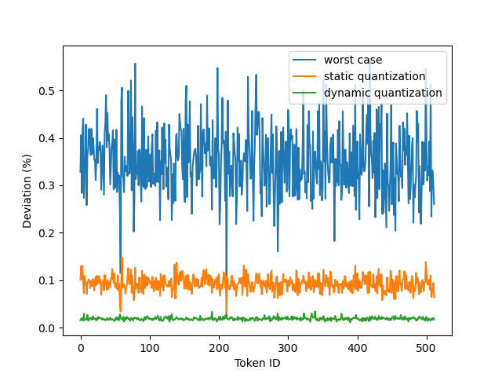
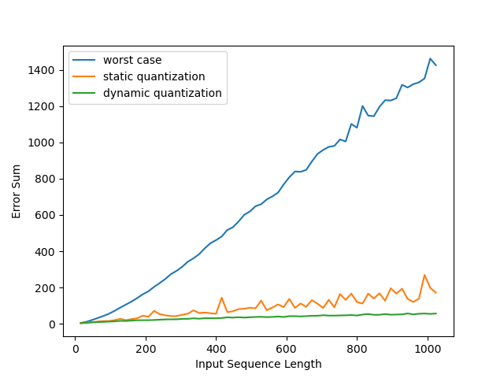

# FMHA-INT8-Quantization

In this work, we quantize fused multi-head attention (FMHA) and Flash-Attention to lower precision 8-bit integers in the Transformer inference. The proposed method leverages the very nature of Softmax computation without requiring further prior knowledge of the input data. We improve the accuracy of the attention output of the fused kernel by about a factor of 2 in the simulation.

## Introduction
In this project, we aim to accelerate the FMHA mechanism during the 8-bit Transformer inference of language and vision models using Iluvatar GPGPU. Compared to FP32 inference, employing 8-bit integer (INT8 and UINT8) potentially consumes 4× less storage space but is up to 6× faster}. To adapt FP32 algorithms to INT8 algorithms, we need two techniques - quantization and dequantization.

## Background: FMHA and FLash-Attention
### Attention 
$$ Attention(\mathbf{Q}, \mathbf{K}, \mathbf{V}) = Softmax\left(\frac{\mathbf{Q} \mathbf{K}^T}{\sqrt{d}}\right)\mathbf{V} $$
### Flash Attention
$$ \mathbf{S}_i = \mathbf{Q}\cdot\mathbf{K}^T_i $$

$$ \tilde{\mathbf{m}}_i = rowmax(\mathbf{S}_i) $$

$$ \tilde{\mathbf{M}}_i = diag{(\tilde{\mathbf{m}}_i)} $$

$$ \mathbf{P}_i = \exp{(\mathbf{S}_i-\tilde{\mathbf{M}}_i\cdot \mathbf{J}}) $$

$$ \tilde{\mathbf{l}}_i = rowsum(\mathbf{P}_i) $$

$$ \mathbf{m}_{i} = \max(\mathbf{m}_{i-1},\tilde{\mathbf{m}}_i) $$

$$ \mathbf{l}_{i} = \exp{(\mathbf{m}_{i-1}-\mathbf{m}_{i})}\cdot \mathbf{l}_{i-1} + \exp{(\tilde{\mathbf{m}}_i-\mathbf{m}_{i})}\cdot \tilde{\mathbf{l}}_i  $$

$$ \mathbf{M}_{i-1} = diag{(\mathbf{m}_{i-1})} $$

$$ \mathbf{M}_i = diag{(\mathbf{m}_{i})} $$

$$ \mathbf{L}_{i-1} = diag{(\mathbf{l}_{i-1})} $$

$$ \mathbf{L}_i = diag{(\mathbf{l}_{i})} $$

$$ \mathbf{O}_i =  \mathbf{L}_i^{-1} \cdot \left[ \mathbf{L}_{i-1} \cdot \exp{(\mathbf{M}_{i-1}-\mathbf{M}_{i})} \cdot  \mathbf{O}_{i-1} + \exp{(\tilde{\mathbf{M}}_i-\mathbf{M}_{i})}  \cdot \mathbf{P}_i \cdot\mathbf{V}_i \right] $$

where 

  
| Model Precision      | BERT BASE 384 |
|    :----:   |    :----:   |
| $\mathbf{Q}_i$  | $\mathbb{R}^{N_{src}\times d}$ |
| $\mathbf{K}_i$  | $\mathbb{R}^{N_{trg}\times d}$ |
| $\mathbf{V}_i$  | $\mathbb{R}^{N_{trg}\times d}$ |
| $\mathbf{S}_i$  | $\mathbb{R}^{N_{src}\times N_{trg}}$ |
| $\mathbf{P}_i$  | $\mathbb{R}^{N_{src}\times N_{trg}}$ |
| $\mathbf{O}_i$  | $\mathbb{R}^{N_{src}\times d}$ |
| $\tilde{\mathbf{m}}_i$  | $\mathbb{R}^{N_{src}}$ |
| $\tilde{\mathbf{l}}_i$  | $\mathbb{R}^{N_{src}}$ |
| $\mathbf{m}_i$  | $\mathbb{R}^{N_{src}}$ |
| $\mathbf{l}_i$  | $\mathbb{R}^{N_{src}}$ |
  

## 8-bit Quantized Attention
### 8-bit FMHA
$$ Attention(\mathbf{Q}_{\texttt{INT8}}, \mathbf{K}_{\texttt{INT8}}, \mathbf{V}_{\texttt{INT8}}) = \left \lbrace\left[ \left[ Softmax \left[ \frac{ \left[ \mathbf{Q}_{\texttt{INT8}} \cdot \mathbf{K}^T_{\texttt{INT8}} \right]_{\texttt{INT32}}}{\sqrt{d}_{\texttt{FP32}}} \right]_{\texttt{FP32}} \right]_{\texttt{INT8}} \cdot \mathbf{V}_{\texttt{INT8}}\right]_{\texttt{INT32}}\right\rbrace_{\texttt{INT8}} $$

See the following figure

The 8-bit quantization schematic diagram of the forward FMHA.

$$\mathbf{S}_{\texttt{INT32}} = \mathbf{Q}_{\texttt{INT8}} \cdot \mathbf{K}^T_{\texttt{INT8}}$$

$$\mathbf{S}_{\texttt{FP32}} = \mathbf{S}_{\texttt{INT32}}\cdot \frac{1}{\sqrt{d}} \cdot\frac{\alpha_q}{127}\cdot\frac{\alpha_k}{127}$$

$$ \mathbf{m}_{\texttt{FP32}} = rowmax(\mathbf{S}_{\texttt{FP32}}) $$

$$ \mathbf{M}_{\texttt{FP32}} = diag(\mathbf{m}_{\texttt{FP32}}) $$

$$ \mathbf{P}_{\texttt{FP32}} = \exp{(\mathbf{S}_{\texttt{FP32}}-\mathbf{M}_{\texttt{FP32}}\cdot \mathbf{J})} $$

$$ \mathbf{l}_{\texttt{FP32}} = rowsum(\mathbf{P}_{\texttt{FP32}}) $$

$$ \mathbf{L}_{\texttt{FP32}} = diag(\mathbf{l}_{\texttt{FP32}}) $$

$$ \mathbf{P}_{\texttt{UINT8}} = \left[\left( \frac{\mathbf{L}_{\texttt{FP32}}^{-1}}{255} \right)^{-1} \cdot \mathbf{L}_{\texttt{FP32}}^{-1} \cdot \mathbf{P}_{\texttt{FP32}}\right]_{0}^{255} = \left[255 \cdot \mathbf{P}_{\texttt{FP32}}\right]_{0}^{255}  $$

$$ \mathbf{O}_{\texttt{INT32}} = \mathbf{P}_{\texttt{UINT8}} \cdot \mathbf{V}_{\texttt{INT8}} $$

$$ \mathbf{O}_{\texttt{FP32}} = \frac{\mathbf{L}_{\texttt{FP32}}}{255} \cdot \frac{\alpha_v}{127} \cdot \mathbf{O}_{\texttt{INT32}} $$

$$ \mathbf{O}_{\texttt{INT8}} = \left[\frac{127}{\alpha_o} \cdot \mathbf{O}_{\texttt{FP32}}\right]_{-127}^{127} $$

$\mathbf{J}$ is matrix of ones in $\mathbb{R}^{N_{src}\times N_{trg}}$. $\alpha_q$, $\alpha_k$, $\alpha_v$ and $\alpha_o$ represent respectively the predetermined maximum absolute value of $\mathbf{Q}$, $\mathbf{K}$, $\mathbf{V}$ and $\mathbf{O}$.

### 8-bit Flash-Attention
$$ \mathbf{S}_{\texttt{INT32},i} = \mathbf{Q}_{\texttt{INT8}}\cdot\mathbf{K}^T_{\texttt{INT8},i} $$

$$ \mathbf{S}_{\texttt{FP32},i} = \mathbf{S}_{\texttt{INT32},i}\cdot \frac{1}{\sqrt{d}} \cdot\frac{\alpha_q}{127}\cdot\frac{\alpha_k}{127}$$

$$ \tilde{\mathbf{m}}_{\texttt{FP32},i} = rowmax(\mathbf{S}_{\texttt{FP32},i}) $$

$$ \tilde{\mathbf{M}}_{\texttt{FP32},i} = diag{(\tilde{\mathbf{m}}_{\texttt{FP32},i})} $$

$$ \mathbf{P}_{\texttt{FP32},i} = \exp{(\mathbf{S}_{\texttt{FP32},i}-\tilde{\mathbf{M}}_{\texttt{FP32},i}\cdot\mathbf{J})} $$

$$ \tilde{\mathbf{l}}_{\texttt{FP32},i} = rowsum(\mathbf{P}_{\texttt{FP32},i}) $$

$$ \tilde{\mathbf{L}}_{\texttt{FP32},i} = diag{(\tilde{\mathbf{l}}_{\texttt{FP32},i})} $$

$$ \mathbf{P}_{\texttt{UINT8},i} = \left[\left( \frac{\tilde{\mathbf{L}}_{\texttt{FP32,i}}^{-1}}{255} \right)^{-1} \cdot \tilde{\mathbf{L}}_{\texttt{FP32,i}}^{-1} \cdot \mathbf{P}_{\texttt{FP32},i}\right]_{0}^{255}=\left[255 \cdot \mathbf{P}_{\texttt{FP32},i}\right]_{0}^{255}$$

$$ \tilde{\mathbf{O}}_{\texttt{INT32},i} = \mathbf{P}_{\texttt{UINT8},i} \cdot\mathbf{V}_{\texttt{INT8},i} $$

$$ \tilde{\mathbf{O}}_{\texttt{FP32},i} =  \frac{\tilde{\mathbf{L}}_{\texttt{FP32},i}^{-1}}{255} \cdot \frac{\alpha_v}{127} \cdot \tilde{\mathbf{O}}_{\texttt{INT32},i} $$

$$ \mathbf{m}_{\texttt{FP32},i} = \max(\mathbf{m}_{\texttt{FP32},i-1},\tilde{\mathbf{m}}_{\texttt{FP32},i}) $$

$$ \mathbf{l}_{\texttt{FP32},i} = \exp{(\mathbf{m}_{\texttt{FP32},i-1}-\mathbf{m}_{\texttt{FP32},i})}\cdot \mathbf{l}_{\texttt{FP32},i-1} + \exp{(\tilde{\mathbf{m}}_{\texttt{FP32},i}-\mathbf{m}_{\texttt{FP32},i})}\cdot \tilde{\mathbf{l}}_{\texttt{FP32},i}  $$

$$ \mathbf{M}_{\texttt{FP32},i} = diag{(\mathbf{m}_{\texttt{FP32},i-1})} $$

$$ \mathbf{M}_{\texttt{FP32},i} = diag{(\mathbf{m}_{\texttt{FP32},i})} $$

$$ \mathbf{L}_{\texttt{FP32},i-1} = diag{(\mathbf{l}_{\texttt{FP32},i-1})} $$

$$ \mathbf{L}_{\texttt{FP32},i} = diag{(\mathbf{l}_{\texttt{FP32},i})} $$

$$ \mathbf{O}_{\texttt{FP32},i} =  \mathbf{L}_{\texttt{FP32},i}^{-1} \cdot \left[ \mathbf{L}_{\texttt{FP32},i-1} \cdot \exp{(\mathbf{M}_{\texttt{FP32},i-1}-\mathbf{M}_{\texttt{FP32},i})} \cdot  \mathbf{O}_{\texttt{FP32},i-1} + \tilde{\mathbf{L}}_{\texttt{FP32,i}} \cdot \exp{(\tilde{\mathbf{M}}_{\texttt{FP32},i}-\mathbf{M}_{\texttt{FP32},i})}  \cdot \tilde{\mathbf{O}}_{\texttt{FP32},i} \right] $$

$$ \mathbf{O}_{\texttt{INT8}, N} = \left[ \frac{127}{\alpha_o} \cdot \mathbf{O}_{\texttt{FP32}} \right]_{-127}^{127} $$

For our Iluvatar MR GPGPU card (https://www.iluvatar.com/), we only have tensor core unit (TCU) with input matrix of identical data type. So we will lose half of the quatization range during in the second GEMM resulting in a loss of precision.

## Result

### Python Simulation

Run python simulation on FMHA to show deviation as follows. Deviation between the 8-bit quantization output and the groudtruth (FP32 reference). The worst case occurs when the quantization parameter $\alpha_p$  is chosen to be 1. Static quantization uses the predetermined maximum possible value of matrix $\mathbf{P}$.

Run python simulation on FMHA to show the error summation of the output when increasing the sequence length as follows. The error summation of the the 8-bit quantization output when compared with the groudtruth (FP32 reference) when increasing the sequence length.

### Run real BERT models with accuracy comparison.
The following table lists the achieved F1 Scores of the BERT model during IXRT inference.

  
| Model Precision      | BERT BASE 384 | BERT LARGE 384 |
|    :----:   |    :----:   |    :----:   |
|Static 8-bit | 87.433 | 89.787|
|Dynamic 8-bit | 87.526 | 89.861|
  

The following table lists the achieved exact matches of the BERT model during IXRT inference.

  
| Model Precision      | BERT BASE 384 | BERT LARGE 384 |
|    :----:   |    :----:   |    :----:   |
|Static 8-bit | 80.123 | 82.800 |
|Dynamic 8-bit | 80.321 | 82.838 |
  

In practice, making the quantization factor greater while fixing the de-quantization factor can improve the two scores a little bit since it can amplify the elements $\mathbf{P}$ with larger values thus effectively pick out the values in $\mathbf{V}$ with higher possibility.

## References
[CMPR21] Sneha Chaudhari, Varun Mithal, Gungor Polatkan, and Rohan Ramanath. An attentive survey of attention models. ACM Transactions on Intelligent Systems and  Technology (TIST), 12(5):1–32, 2021.

[DFE+22] Tri Dao, Daniel Y Fu, Stefano Ermon, Atri Rudra, and Christopher R ́e. Flashat- tention: Fast and memory-efficient exact attention with io-awareness. arXiv preprint arXiv:2205.14135, 2022.

[GSZ+18] Jiong Gong, Haihao Shen, Guoming Zhang, Xiaoli Liu, Shane Li, Ge Jin, Niharika Ma-heshwari, Evarist Fomenko, and Eden Segal. Highly efficient 8-bit low precision inference of convolutional neural networks with intelcaffe. In Proceedings of the 1st on Reproducible Quality-Efficient Systems Tournament on Co-designing Pareto-efficient Deep Learning, page 1. 2018.

[PTDU16] Ankur P Parikh, Oscar T ̈ackstr ̈om, Dipanjan Das, and Jakob Uszkoreit. A decomposable attention model for natural language inference. arXiv preprint arXiv:1606.01933, 2016.

[QB18] Jerry Quinn and Miguel Ballesteros. Pieces of eight: 8-bit neural machine translation. arXiv preprint arXiv:1804.05038, 2018.

[VSP+17] Ashish Vaswani, Noam Shazeer, Niki Parmar, Jakob Uszkoreit, Llion Jones, Aidan N Gomez, Lukasz Kaiser, and Illia Polosukhin. Attention is all you need.  Advances in neural information processing systems, 30, 2017
